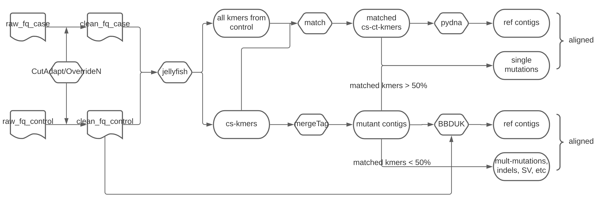
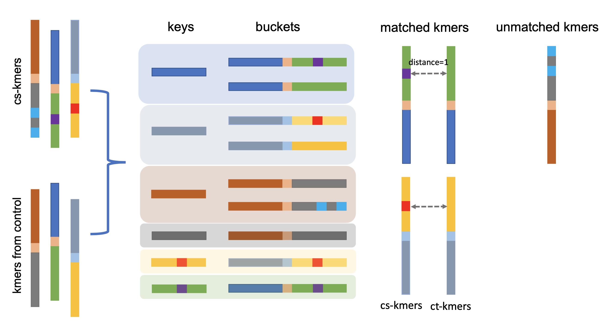

# 2-kupl: mapping-free variation detection from DNA-seq data of matched samples

## Schematic view of the pipeline



Gene functions are frequently changed by somatic variations, including mutations, indels and structural variations, which lead to gain and loss of functions. Detecting these variations, especially in cancer research, is an essential and challenging computational problem. Pathogenic factors and potential therapeutic targets could be captured from the DNAseq data via canonical mapping-based methods. Nevertheless, large indels, aggregated mutations and structural variations are difficult to be mapped to the genome. Besides, the low complexity regions such as repeat and tandem duplication are often ignored considering the mapping quality (MAPQ) of reads. These regions, called “dark genome” are the goldmine of unknown disease driving variations. Herein, we introduce 2-kupl, a novel mapping-free protocol to detect somatic variations from DNAseq data. Compared with other protocols, 2-kupl can’t outperform GATK-MuTect2 but achieve a higher F1 score than the other mapping-free protocols. Using 2-kupl, we also identify novel recurrent variations on prostate cancer patients from TCGA. 


## Dependencies

2-kupl relies on the following libraries and softwares: 

- **[numpy](https://www.numpy.org/)** NumPy is the fundamental package for scientific computing with Python. 
- **[pandas](https://www.pandas.org/)** Pandas is a python library that allows you to easily manipulate data to analyze. 
- **[biopython](https://biopython.org/)** Biopython is a set of freely available tools for biological computation written in Python by an international team of developers.
- **[tqdm](https://pypi.org/project/tqdm/)** tqdm is a Fast, Extensible Progress Meter.
- **[scipy](https://pypi.org/search/?q=scipy)** SciPy is open-source software for mathematics, science, and engineering.
- **[pydna](https://pypi.org/project/pydna/)** The pydna python package provide a human-readable formal descriptions of dna assembly strategies in Python.
- **[jellyfish](https://anaconda.org/conda-forge/jellyfish)** Jellyfish is a tool for fast, memory-efficient counting of k-mers in DNA
- **[cutadapt](https://anaconda.org/bioconda/cutadapt)** Cutadapt helps with these trimming tasks by finding the adapter or primer sequences in an error-tolerant way. 
- **[GSNAP](https://anaconda.org/compbiocore/gsnap)** GSNAP: A tool for aligning RNA-Seq and DNA-Seq datasets to genomes
- **[CAP3](https://anaconda.org/bioconda/cap3)** CAP3: A DNA Sequence Assembly Program
- **[BBDUK](https://jgi.doe.gov/data-and-tools/bbtools/bb-tools-user-guide/bbduk-guide/)** BBDuk was developed to combine most common data-quality-related trimming, filtering, and masking operations into a single high-performance tool. 

## Installation

Users can manually download the scripts or use the command line as follows.

`git clone https://github.com/yunfengwang0317/2-kupl.git`
    
Make sure you run 2-kupl within the script folder.
Please add the dependencies including Jellyfish, cutadapt, GSNAP, CAP3 and BBDUK to your environment variables. 
    
## Basic usage
```
USAGE

    python3 pipeline.py --m1 mutant_r1.fq.gz --m2 mutant_r2.fq.gz --w1 wild_r1.fq.gz --w2 wild_r2.fq.gz -o output
    
    MANDATORY PARAMETERS:
    --m1 mutant1    The compressed fq format file of mutant type library

    --m2 mutant2    The compressed fq format file of the second mutant type library in case the data is paired-end

    --w1 wild1  The compressed fq format file of wild type library

    --w2 wild2  The compressed fq format file of the second wild type library in case the data is paired-end

    -o outdir   The directory of output results (default mutcaller_result)

    OPTIONAL PARAMETERS:
    --type datatype The data type of input, RNAseq, WES or genome (default WES)
.
    -m method   The algorithm to calculate the distance (edit or hamming), which is a main parameter for bbduk (default hamming)

    -d distance The max distance between kmer and reads (default 1)

    -l lowdepth The contigs whose numbers of corresponding reads retrieved by bbduk are lower than this parameter will be removed (default 20)

    -c cutoff   Cutoff of relative coverage and contigs with AF larger than this value will be regarded as variants(default 0.05)

    -t thread   The number of threads used in searching pair kmers and variant calling process(default 20)

    -f filter   Method used to remove low quanlity bases (default cutadapt)

    --sp support    Kmers whose counts are larger than this value and absent in the control or reference will be used as case specific kmers (default 5)

    --nbk nb_kmers  Contigs with nb_kmers larger than this value will be used in the downstream analysis (default 1)

    --genome genome If genome.fa provided, the contigs in vcf file will be replaced with corresponding chrom and position on genome (default None)

    --help  Help information
```


## Output files
```
|-- case_specific_kmers
|   |-- case.jf
|   |-- case.txt.gz
|   |-- control.jf
|   |-- control.txt.gz
|-- contig_pair
|   |-- contigs.gz
|   |-- contigs_pairedspkmers
|   |-- kmerpair.csv
|-- contig_unpair
|   |-- FailedToInferRef.txt
|   |-- contigs_unpaired
|-- control_jf.sh
|-- merged_contigs
|   |-- contigs.fa
|   |-- merged_contigs.gz
`-- variant_result
    |-- SNV_alignments.txt
    |-- SNV_alignments.vcf
    |-- SNV_alignments_ref.vcf
    `-- variant_report.txt
```

The following table describes the output files produced by 2-kupl :

FileName | Description
---------|------------
`merged_contigs.gz` | Contains assembled contigs from `case specific kmers (cs-kmers)`.
`contigs_pairedspkmers` | Contains assembled contigs in which more than half of `cs_kmers` are matched.
`contigs_unpaired` | Contains assembled contigs in which fewer than half of `cs_kmers` are matched.
`SNV_alignments.txt` | The pairwise alignment between mutant contig and putative reference.
`SNV_alignments.vcf` | The VCF format output containing mutant contig, putative reference, cs_count, coverage, allele frequency and Phred scores.
`SNV_alignments_ref.vcf` | The genomic coordinates are added if the `genome reference` is provided by users.
`variant_report.txt` | A summary report of all variant.

*Notes* :
cs_kmers: case specific kmers; ct_kmers: The counterpart kmers matched with cs_kmers with Hamming Distance of one; cs_count: average kmer count of all cs_kmers in the same contig; coverage: estimated from the average counts of ct_kmers in the same contig; Phred scores: computed with the following formula `-10log(Pvalue)` where Pvalue is calculated using the fisher exact test.


